# MMM
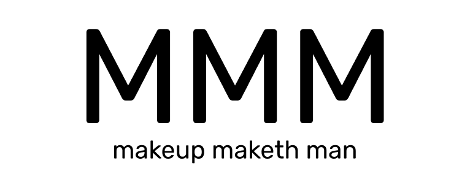

makeup makes man. 

MMM 서비스는 **남성 뷰티 쇼츠 및 판매 플랫폼 웹서비스**입니다.

> 본 서비스는 2021년 *숭실대학교 웹/앱 서비스 개발 경진대회* '똥워니기싱꿍꼬또' 팀의 출품작입니다.

## 개요

MZ 세대가 자기관리의 중요성에 주목하고 있습니다.

2020년에 들어서며 외모를 경쟁력으로 생각하며 패션과 미용에 시간을 투자하는 남성들,
일명 그루밍족의 등장으로 국내 남성 화장품 시장의 규모가 폭발적으로 증가하고 있습니다.
하지만, 여전히 남성의 메이크업은 여전히 사회적으로 좋지 않은 인식을 받고 있습니다.

오픈서베이에서 조사한 남성 그루밍 트렌드 리포트 2021을 보면, 
메이크업을 하지 않는 이유로 남성스럽지 않다는 부정적 인식, 시작 방법을 몰라서 등이 언급되고 있습니다.

**MMM 프로젝트는 이와같은 메이크업 시작을 막는 진입장벽을 해소하는 솔루션을 제공하기 위해 기획된 서비스입니다.**

### 서비스 설명 및 데모 시연 링크
https://youtu.be/IzL-jVg5qSQ

### 문제점
현재 남성 뷰티 시장이 겪고있는 문제점을 크게 3가지로 정리해보았습니다.

1. **성장하는 남성 뷰티 시장에 비해 부족한 뷰티 컨텐츠와 커뮤니티**  
남성 뷰티가 성장하는데 비해 부족한 컨텐츠와 커뮤니티는 남성 뷰티 시작을 막는 방해요소입니다.

2. **화장이 처음인 사람들을 위한 빠르고 쉬운 가이드라인 부재**  
남성 뷰티에 대한 가이드의 부재는 남성 뷰티 진입 장벽을 높이는 요소가 됩니다.

3. **커뮤니티와 판매처의 분리**  
커뮤니티와 판매처의 분리는 정보 획득과 구매를 동시에 하려는 유저들에게 구매까지의 과정을 길고 불편하게 만듭니다.

### 솔루션
저희 팀은 문제점에 대한 솔루션을 다음과 같이 제시했습니다.

1. **뷰티 컨텐츠 공유 플랫폼 제공**  
뷰티 컨텐츠 크리에이터와 컨텐츠 소비자가 공존하는 뷰티 컨텐츠 플랫폼을 제공해야합니다.

2. **화장을 처음 접하는 사람들을 위한 가이드 제공**  
간편하게 시작할 수 있는 맞춤형 컨텐츠를 제공해 남성 화장으로 가는 진입 장벽을 낮춰야합니다.

3. **남성 맞춤 뷰티 화장품을 빠르게 구매할 수 있는 서비스 제공**  
정보를 얻을 수 있는 뷰티 컨텐츠와 관련 상품을 빠르게 구매할 수 있는, 즉, 커뮤니티와 판매 서비스가 결합된 형태의 플랫폼을 제공해 구매 과정을 단축시켜야 합니다.

### 서비스 핵심기능
MMM 서비스는 앞서 말한 솔루션을 제공하기 위한 서비스로 기획되었습니다.

MMM 서비스의 핵심 구조는 다음과 같습니다.

#### 뷰티 관련 SHORTS 업로드 및 공유

사용자들이 직접 제작한 shorts 영상을 업로드하고 공유할 수 있는 서비스를 제공합니다. 재미있고 유용한 뷰티 shorts는 누구나 열람 가능하고 평가할 수 있습니다.

#### AI 얼굴 분석

본인의 얼굴 사진을 업로드하면 AI 분석을 통해 피부톤과 얼굴형을 알려주고 시도해 볼만한 화장법을 알려주는 shorts를 소개해줍니다. 간단히 사진을 올리는 것 만으로도 화장을 처음 시작하는 사람들에게 화장 시작 가이드를 제공할 수 있습니다.

#### 뷰티 상품 판매 플랫폼

업로드 된 shorts 컨텐츠와 상품 판매/구매 서비스가 공존하는 플랫폼으로 short를 통해 상품에 대한 더욱 풍부한 정보를 얻을 수 있고, 플랫폼 내에서 제공하는 구매 서비스로 빠르게 구매까지 할 수 있습니다. 

### 서비스 구조
서비스의 전체적인 구조 및 사용자 시나리오 입니다.

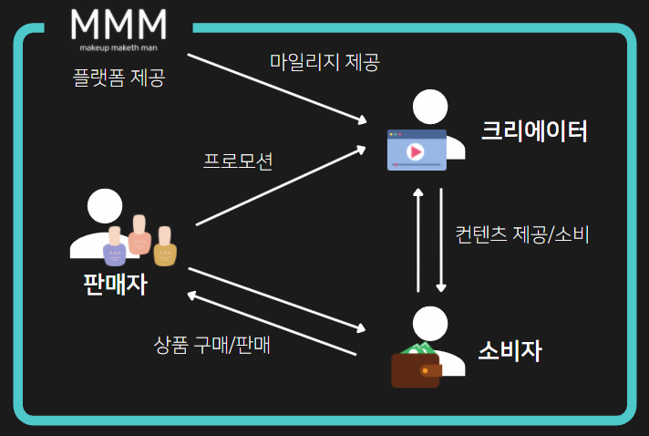  
[서비스 구조]

- 판매자는 소비자에게 상품을 판매하고 소비자는 상품을 구매한다.

- 크리에이터는 소비자에게 컨텐츠를 제공하고 소비자는 컨텐츠를 소비한다.

- 판매자는 크리에이터와 프로모션 계약을 맺을 수 있다.

- 플랫폼 이용자는 활동에 따라 마일리지를 쌓을 수 있고 마일리지는 상품 구매에 사용할 수 있다.

- 소비자도 크리에이터가 될 수 있고, 크리에이터도 소비자가 될 수 있다.

### 수익 구조

  
[수익 구조]

서비스 내에 수익은 2가지 경우에 발생합니다.
1. 판매자가 크리에이터에게 프로모션을 맡길 시.  
크리에이터가 판매자로부터의 프로모션을 MMM 서비스 위에서 진행할 경우 크리에이터는 일정 수수료를 플랫폼에 지불해야합니다.

2. 상품 구매 시  
입점한 판매자의 상품을 소비자가 구매하게 되면 일정 수수료를 플랫폼에 지불해야합니다.

## 배포 사이트 (데모 사이트)
http://34.64.76.43:3000

위 사이트에 접속해 데모 서비스를 경험해 볼 수 있습니다.
데모 사이트는 `2021/12/13 23:59` 까지 운영할 예정입니다.

### 주의사항

화면은 데스크탑 크롬 브라우저 환경(1920x1080)에 최적화되어 설계되었으므로 모바일이나 기타 브라우저로 접속 시 화면이 정상적으로 나오지 않을 수 있습니다.
또한 데모 버전 이므로 일부 기능이 정상적으로 동작하지 않을 수 있음을 인지 후 이용해주시기 바랍니다.

### 데모 계정
데모 계정은 다음과 같습니다.

ID: myid
PW: mypassword

## 상세 페이지 설명
서비스 페이지별 구성 & 기능에 대한 설명입니다.

### 홈페이지

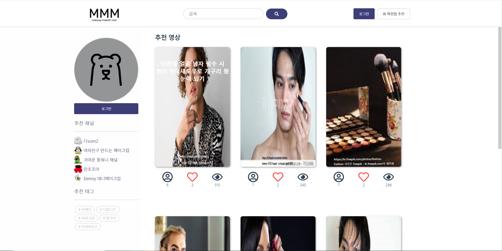
[홈페이지]

홈페이지 입니다.
추천 쇼츠를 모아볼 수 있고 추천 채널, 추천 태그를 사이드바에서 확인할 수 있습니다.

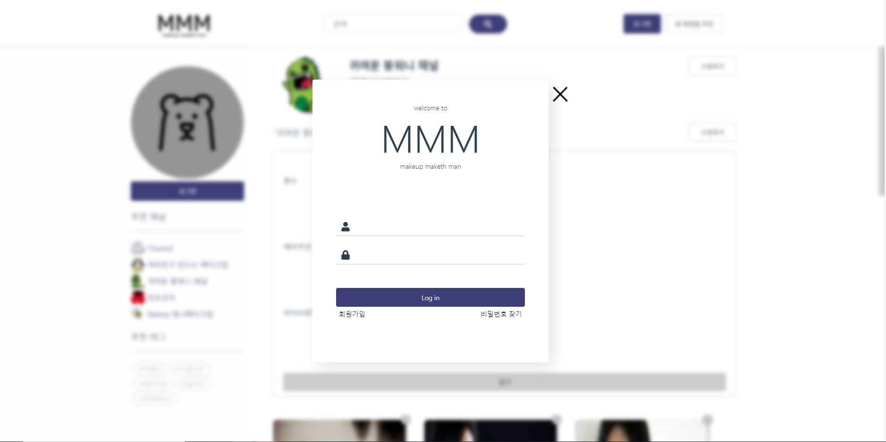
[로그인]

로그인 화면입니다. 왼쪽 사이드바의 로그인 버튼이나, 헤더의 로그인 버튼을 통해 로그인 화면을 열 수 있습니다.

로그인 시, 사이드바의 추천 채널이 구독한 채널로 바뀌게 됩니다.

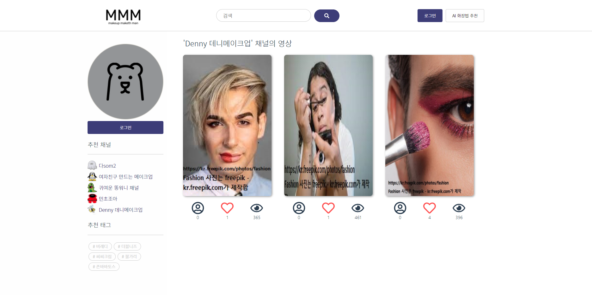
[추천 채널, 구독한 채널]
구독한 채널, 또는 추천 채널을 누르면 해당 채널의 영상을 모아볼 수 있습니다.

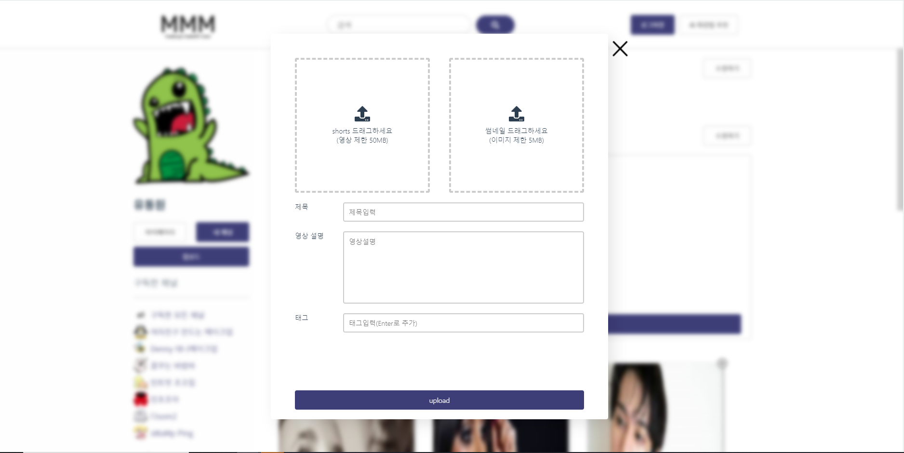
[추천 채널, 구독한 채널]
사이드바의 업로드 버튼을 통해 쇼츠를 업로드할 수 있습니다.

추천 채널을 누르거나 구독한 채널을 누르면 그 채널의 영상을 바로 모아볼 수 있습니다.

### short 페이지

쇼츠 영상을 클릭하면 볼 수 있는 페이지입니다.
페이지 왼쪽은 쇼츠가 나오고, 오른쪽에선 쇼츠를 업로드한 채널, 관련 상품, 댓글등을 볼 수 있습니다. 관련상품을 클릭하면 상품 페이지로 바로 이동할 수 있습니다.

### 상품 페이지
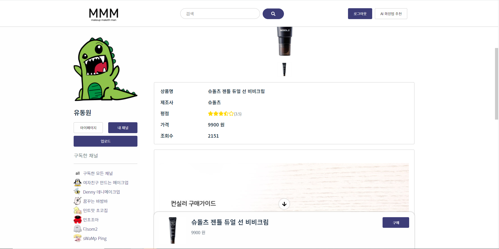
[상품 페이지 상단]

상품을 눌러 상품페이지로 이동하게되면, 상품 사진, 간략한 정보, 자세한 정보를 확인할 수 있습니다.

화면 하단의 구매 가이드를 통해 간단하게 상품 구매 창을 열 수 있습니다.

[구매 버튼 클릭시 나오는 구매 창]

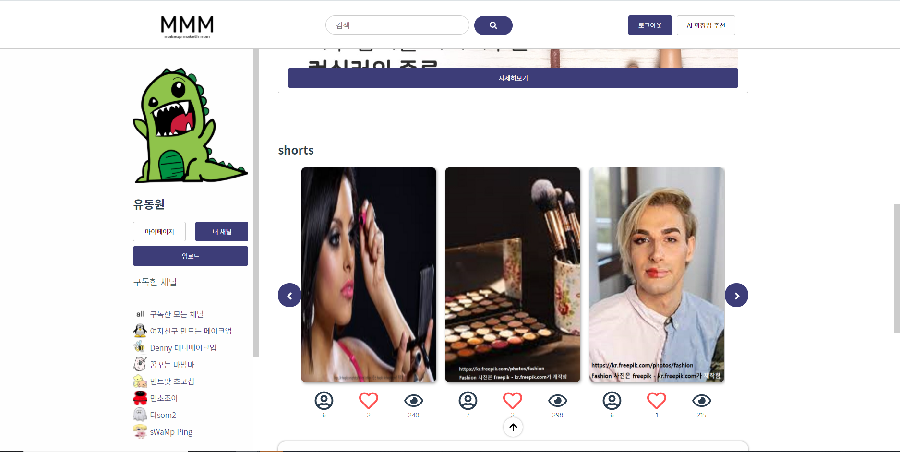
[상품 페이지 중단]

상품 정보 하단엔 상품과 관련된 크리에이터의 쇼츠를 보여줍니다. 

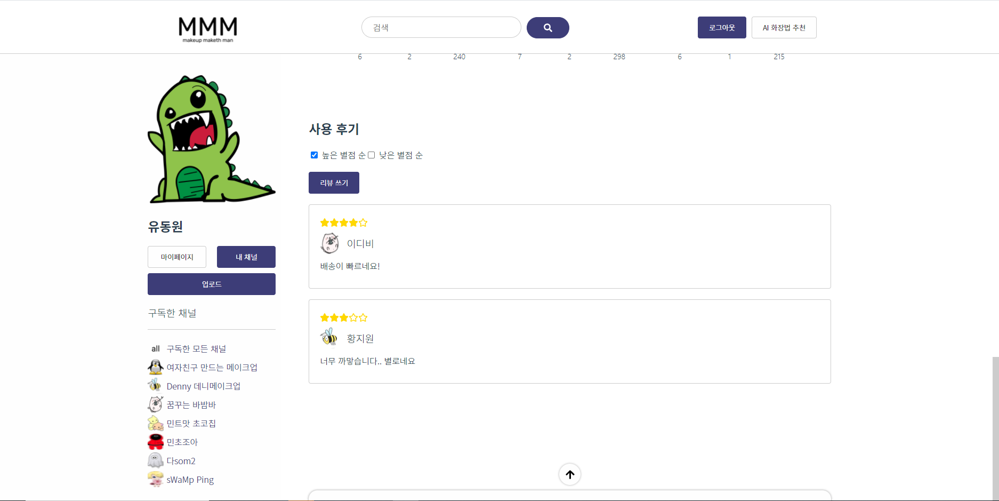
[상품 페이지 하단]

구매 페이지 하단에선 제품을 구매한 사용자들의 사용 후기를 볼 수 있습니다.
또한 상품을 구매한 적 있다면 사용 후기를 작성할 수 있습니다.

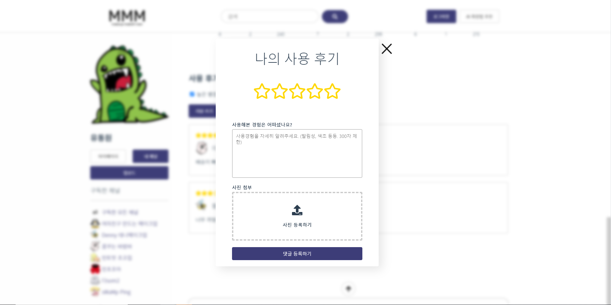
[리뷰 작성 창]

### 채널 페이지
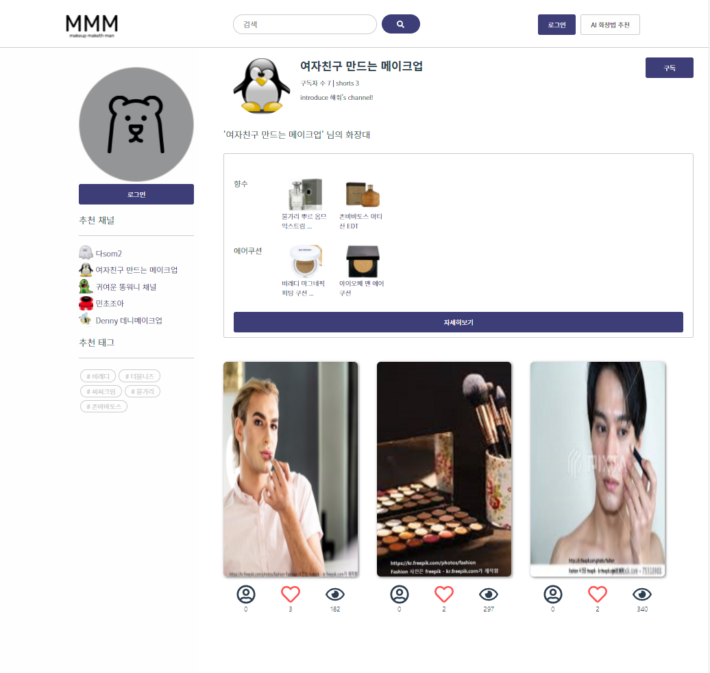
[남의 채널 페이지]

채널 페이지에선 채널 정보 확인 및 구독을 할 수 있습니다.
구독시 해당 채널의 활동을 알람으로 받을 수 있습니다.

채널엔 화장대 기능이 있습니다. 유저들은 화장대를 통해 해당 크리에이터가 사용하는 화장품을 모아볼 수 있습니다.

채널 페이지 하단에선 크리에이터가 올린 쇼츠를 모아볼 수 있습니다.

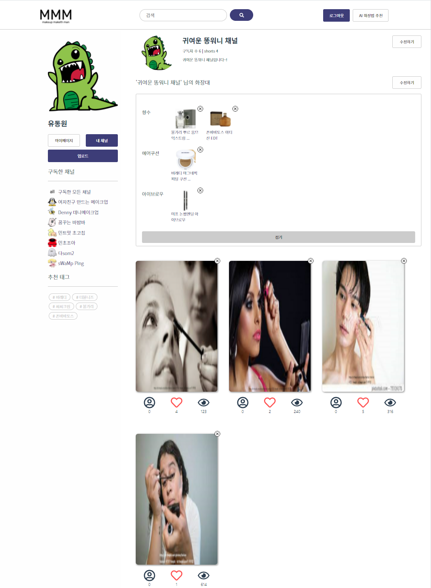
[나의 채널 페이지]

로그인 되어있을 때 왼쪽의 내 채널 버튼을 통해 '나의 채널 페이지'로 이동할 수 있습니다.
'나의 채널 페이지'에선 채널 정보를 관리하고 화장대를 수정하거나 올린 쇼츠를 관리할 수 있습니다.

### 검색 페이지
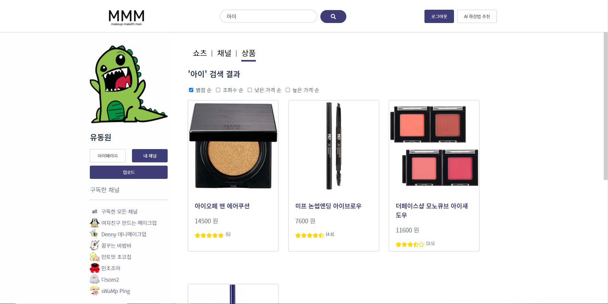
[검색 페이지]

화면 상단의 검색창을 통해 검색 페이지로 이동할 수 있습니다. 하나의 검색어로 쇼츠,채널,상품을 각각 모아 볼 수 있습니다.

### AI 페이지
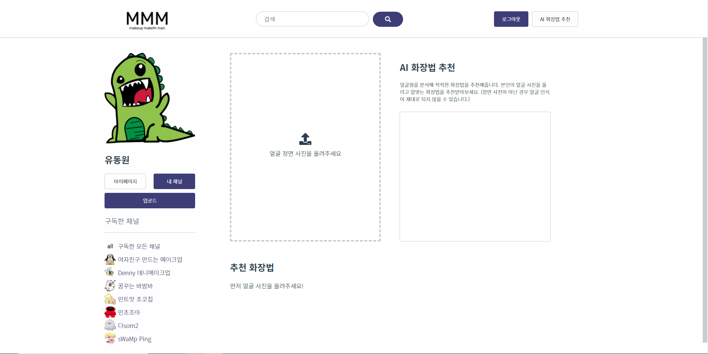
[AI 추천 페이지 - 이미지 분석 전]

상단의 'AI 추천 페이지' 버튼을 통해 AI 추천 페이지로 이동할 수 있습니다.

왼쪽의 그래그 엔 드롭 존에 본인의 얼굴 사진을 올려 이미지 분석을 시작할 수 있습니다.
얼굴 사진이 충분히 크지 않거나 정면이 아닌 경우 제대로 된 분석이 나오지 않을 수도 있습니다.

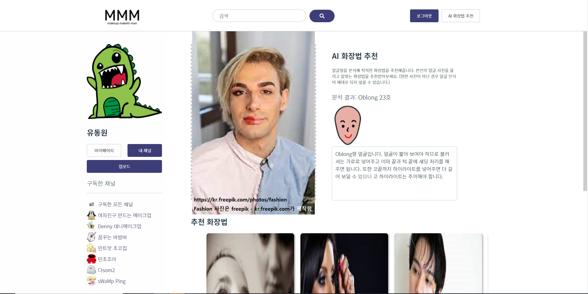
[AI 추천 페이지 - 이미지 분석 후]

얼굴 분석이 끝나면 얼굴형, 피부톤에 대한 정보가 나오고, 하단에 분석 결과를 바탕으로한 추천 쇼츠들이 나옵니다. 화장을 처음 접하는 유저도 이를 통해 빠르게 화장을 시작할 수 있습니다.

## 서비스 기대 효과
MMM 서비스가 제시한 솔루션은 더 많은 남성들의 메이크업 시작화 커뮤니티의 활성화를 가져오고, 이는 남성 메이크업에 대한 사회의 부정적 인식에 변화를 줄 것입니다. 부정적 인식의 변화는 다시 남성 뷰티 시장의 확대와 성장을 가져오고 더 많은 남성이 메이크업 시장에 참여하도록 유도하는 선순환 구조를 형성할 것이라 기대됩니다.  

## 개발 환경 
|제목|내용|
|---|---|
|Front-end| Vue, Vuex, Vue-router  
|Back-end| Nodejs, Express  
|DB| MySQL  
|DevOps| Google Cloud Platform, Docker, Github  
|Communication & Design| Figma  
|AI | Tensorflow, Scikit-learn, Teachable Machine

## 연락 & 개발자들
추가로 궁금하신 사항은 second28200@naver.com 으로 연락주시면 됩니다.

### 팀장
프론트 개발자 양기조 [@dev2820](https://github.com/dev2820)

### 팀원
프론트 개발자 유동원  
백엔드 개발자 김현호  
백엔드 개발자 박현우  
AI 개발자 황지원  

## Change Log
본 프로젝트는 경진대회 출품작으로 추가적인 업데이트는 없을 예정입니다.
